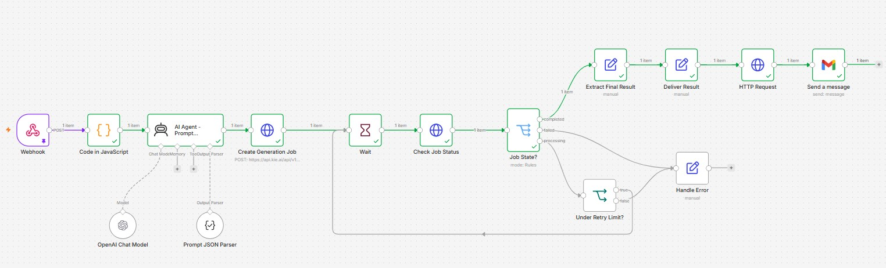

 # 🚀 AI LinkedIn Auto-Posting Automation with n8n

An AI-powered LinkedIn automation workflow built with **n8n** that automatically creates and publishes LinkedIn posts on a scheduled basis.

## ✨ What This Workflow Does

This automation takes pending content ideas from **Google Sheets**, finds the related image from **Google Drive**, generates a professional LinkedIn caption using **AI**, publishes the post on **LinkedIn**, and finally updates the Google Sheet to mark the content as **Posted**.

## 🔄 Workflow
### 📸 Workflow Preview


```text
Schedule Trigger
       ↓
Google Sheets
       ↓
Google Drive
       ↓
Download Image
       ↓
AI Agent
       ↓
Merge
       ↓
LinkedIn
       ↓
Google Sheets
🤖 AI Content Generation
The AI Agent automatically creates a LinkedIn post based on the workflow name and description.
It generates:
Professional LinkedIn content
Problem and solution explanation
Workflow explanation
AI & n8n usage
Business benefits
Relevant emojis
5–8 relevant hashtags
The AI is instructed not to invent features that are not included in the workflow description.
⚙️ Technologies Used
n8n — Workflow automation
OpenAI — AI-powered caption generation
Google Sheets — Content queue and status tracking
Google Drive — Image storage
LinkedIn — Automatic post publishing
⏰ Automatic Scheduling
The workflow is configured to run automatically:
Tuesday — 5 PM
Thursday — 5 PM
Saturday — 5 PM
📊 Google Sheets Queue
Each content row contains information such as:
Workflow
Description Topic
Image File Name
Status
Posted Date
The automation picks the first pending item, publishes it, and then updates its status to Posted.
🔁 Fully Automated Process
Once the content and image are added to the Google Sheet and Google Drive, the rest of the process happens automatically:
Content → AI Caption → Image + Caption → LinkedIn → Status Update
🔐 Setup
Import the workflow JSON into n8n.
Connect your Google Sheets credentials.
Connect your Google Drive credentials.
Connect your OpenAI credentials.
Connect your LinkedIn credentials.
Configure your Google Sheet.
Upload the required images to Google Drive.
Configure the schedule.
Activate the workflow.
⚠️ Make sure to replace all credentials and personal IDs with your own accounts before running the workflow.
📁 Workflow File
The n8n workflow JSON is available here:
LinkedIn Workflow Automation.json
🎯 Use Case
This automation is useful for developers, creators, agencies, and businesses that want to maintain a consistent LinkedIn presence without manually creating and publishing every post.
⭐ If you find this workflow useful, feel free to star the repository

---
🤖 AI Content Automation System — n8n

An end-to-end AI content generation automation workflow built with n8n.

The system receives a user's content request through a Webhook, uses OpenAI GPT-5-mini to optimize the generation prompt, sends the request to Kie.ai, monitors the asynchronous generation job, handles processing/retry/failure states, extracts the generated result, downloads the file, and automatically delivers it through Gmail.

«Current implementation: AI image generation using "grok-imagine/text-to-image".»

---

📸 Workflow Preview

"

---

🚀 Project Overview

This workflow automates the complete AI content generation pipeline:

User Request → Prompt Optimization → AI Generation → Job Monitoring → Result Extraction → File Download → Email Delivery

The main workflow is designed around a Webhook-based API input and asynchronous AI generation through Kie.ai.

It is primarily implemented for image generation. Although the input structure supports both image and video content types, the currently connected Kie.ai generation model is configured specifically for image generation.

---

🔄 Workflow Architecture

Webhook
   ↓
Code in JavaScript
   ↓
AI Agent — Prompt Generator
   ↓
Prompt JSON Parser
   ↓
Create Generation Job
   ↓
Wait 30 Seconds
   ↓
Check Job Status
   ↓
Job State?
   ├── Success → Extract Final Result
   │                  ↓
   │             Deliver Result
   │                  ↓
   │             HTTP Request
   │                  ↓
   │                Gmail
   │
   ├── Failed → Handle Error
   │
   └── Processing → Under Retry Limit?
                         ↓
                       Wait
                         ↓
                  Check Job Status

---

🧩 Workflow Components

1. Webhook

The Webhook acts as the main entry point of the automation.

It receives the user's content generation request through an HTTP "POST" request.

Expected Input

- "name"
- "email"
- "prompt"
- "content_type"
- "style"
- "aspect_ratio"
- "quality"

Example Request

{
  "name": "SD Khan",
  "email": "rk4575809@gmail.com",
  "prompt": "A sleek matte black futuristic sports car drifting on a wet city street at night, glowing red tail lights, neon background reflections, rain drops on camera lens, photorealistic, 8k resolution",
  "content_type": "image",
  "style": "Photorealistic",
  "aspect_ratio": "16:9",
  "quality": "high"
}

---

2. Code in JavaScript

The JavaScript node cleans and structures the incoming Webhook data before passing it to the AI Agent.

It separates the information into:

User Information

- "client_name"
- "client_email"

AI Payload

- "prompt"
- "content_type"
- "formatted_prompt"
- "aspect_ratio"
- "quality"

Default Values

The workflow also applies default values when information is missing:

- Aspect ratio → "16:9"
- Quality → "high"
- Style → "photorealistic"

This keeps the input consistent and easier for downstream nodes to process.

---

3. AI Agent — Prompt Generator

The AI Agent works as an intelligent prompt engineer.

Its purpose is not to generate the image directly.

Instead, it transforms the user's basic request into a more detailed and optimized generation prompt.

The AI considers:

- User description
- Content type
- Style
- Aspect ratio
- Quality/duration requirements

The AI Agent uses an OpenAI Chat Model with GPT-5-mini for the prompt-generation stage.

Expected Output

{
  "prompt": "optimized generation prompt",
  "content_type": "image",
  "aspect_ratio": "16:9",
  "style": "photorealistic",
  "additional_parameters": {}
}

---

4. Prompt JSON Parser

The Prompt JSON Parser ensures that the AI Agent response follows the required structured JSON format.

Expected fields include:

- "prompt"
- "content_type"
- "aspect_ratio"
- "style"
- "additional_parameters"

This prevents an unstructured AI response from being sent directly to the generation API.

---

5. Create Generation Job

The optimized prompt is sent to the Kie.ai API.

Endpoint

https://api.kie.ai/api/v1/jobs/createTask

Method

POST

Current Model

grok-imagine/text-to-image

The request sends the optimized generation prompt and aspect ratio.

Kie.ai returns a task ID, which is used by the workflow to monitor the generation process.

---

6. Wait

After creating the generation job, the workflow waits 30 seconds.

This gives the external AI generation service time to process the request before the workflow checks its status.

---

7. Check Job Status

The workflow checks the Kie.ai generation job using the previously created task ID.

The response provides the current generation state.

The workflow handles states such as:

- "success"
- "fail"
- "processing"
- "waiting"

---

8. Job State?

The Job State Switch node controls the workflow based on the generation status.

✅ Success

If:

data.state = success

The workflow continues to:

Extract Final Result

❌ Failed

If:

data.state = fail

The workflow continues to:

Handle Error

⏳ Processing

If the job is still processing, the workflow checks:

Under Retry Limit?

The workflow can perform additional status checks until the configured retry limit is reached.

---

9. Extract Final Result

When generation succeeds, this node extracts the generated content URL from Kie.ai's response.

It also stores important tracking information:

- "result_url"
- "content_type"
- "original_prompt"
- "generation_prompt"
- "task_id"

The generated URL is extracted from Kie.ai's "resultJson".

---

10. Deliver Result

The Deliver Result node prepares a user-friendly delivery message.

Example:

Your image is ready: [generated result URL]

The node also keeps the relevant information from the previous workflow stage.

---

11. HTTP Request — Download Generated Content

After extracting the generated result URL, an HTTP Request node downloads the generated content.

The response is configured as a file/binary response.

This allows the generated content to be passed to Gmail as an email attachment.

---

12. Gmail — Send a Message

The final stage sends the generated image to the user's email address.

The recipient email comes directly from the original Webhook request.

Email Subject

Your Generated Image is Ready! 🎨

The generated content is delivered as an email attachment.

---

🛡️ Error Handling & Retry System

The workflow includes dedicated error handling and retry protection.

Error Handling

When generation fails, the workflow creates information including:

- Error flag
- Error message
- Task ID

This makes it easier to identify which generation job failed and why.

Retry Protection

If the generation job is still processing, the workflow checks whether it is below the retry limit.

Maximum Retry Limit

10 runs

If the retry limit has not been reached:

Wait → Check Job Status

If the retry limit is reached:

Handle Error

This prevents the workflow from polling an external API indefinitely.

---

📝 Input Form

The workflow also contains an AI Content Generator form configuration.

The form is designed to collect:

1. Content Description / Prompt — Required
2. Content Type — Image or Video
3. Style — Optional
4. Aspect Ratio — Optional
5. Quality / Duration — Optional

Available Aspect Ratios

- "1:1"
- "16:9"
- "9:16"
- "4:3"
- "3:2"

«Important: The Form Trigger is currently disabled and is not connected to the main workflow. The active workflow input is the Webhook.»

---

🧰 Technologies Used

- n8n — Workflow automation
- OpenAI GPT-5-mini — Prompt optimization
- n8n AI Agent — AI prompt engineering
- Structured Output Parser — JSON validation
- Kie.ai API — AI content generation
- grok-imagine/text-to-image — Current image generation model
- JavaScript — Data processing
- HTTP Request — API communication and file download
- Gmail — Automated result delivery
- JSON — Structured data exchange
- Webhooks — API-based workflow triggering

---

✨ Key Features

- 🤖 AI-powered prompt optimization
- 🧠 GPT-5-mini prompt engineering
- 🧩 Structured AI output
- 🎨 Automated image generation
- 🔌 External API integration
- ⏳ Asynchronous job monitoring
- 🔄 Automatic retry mechanism
- 🛡️ Maximum retry protection
- 🚦 Success / processing / failure routing
- 🔗 Automatic result URL extraction
- 📥 Automatic generated-file download
- 📧 Gmail delivery with attachment
- ⚠️ Dedicated error handling
- 🆔 Task ID tracking
- 🌐 Webhook-based API input

---

📊 Automation Flow

Stage| Purpose
Webhook| Receive content request
JavaScript| Clean and structure input
AI Agent| Optimize generation prompt
JSON Parser| Validate structured AI output
Kie.ai| Create generation job
Wait| Allow generation processing
Job Status| Monitor generation
Switch| Route by job state
Retry System| Recheck processing jobs
Result Extraction| Extract generated URL
HTTP Request| Download generated content
Gmail| Deliver final result

---

🎯 Project Goal

The goal of this project is to demonstrate how n8n, AI models, external APIs, asynchronous job processing, retry logic, and email automation can be combined into a complete AI content generation pipeline.

Instead of manually optimizing prompts, starting generation jobs, monitoring their progress, downloading the result, and sending it to the user, the entire process is automated.

---

⚠️ Implementation Notes

This repository documents the workflow based on its current implementation.

Current generation capability

The connected Kie.ai model is:

grok-imagine/text-to-image

Therefore, the implemented generation path is currently image generation.

The input structure supports "image" and "video" content types, but the current Kie.ai API configuration has not been extended into a separate video-generation implementation.

Workflow status

The workflow is currently:

active: false

The Form Trigger is also disabled.

The connected production flow starts from:

Webhook

These details are intentionally documented to accurately represent the current implementation.

---

📁 Project Files

The repository contains the n8n workflow JSON and supporting project assets.

The workflow can be imported into an n8n instance and configured with the required credentials and API access.

«Security: Never commit API keys, passwords, OAuth tokens, or other credentials to the repository.»

---

🔖 GitHub Topics

Recommended repository topics:

n8n
ai-automation
workflow-automation
ai-content-generation
prompt-engineering
openai
kie-ai
grok-imagine
api-automation
generative-ai
javascript
gmail-automation

---

👨‍💻 Project

AI Content Automation System — n8n

Built to demonstrate practical AI-powered workflow automation using n8n, OpenAI, Kie.ai, APIs, JavaScript, and Gmail.
